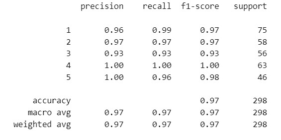
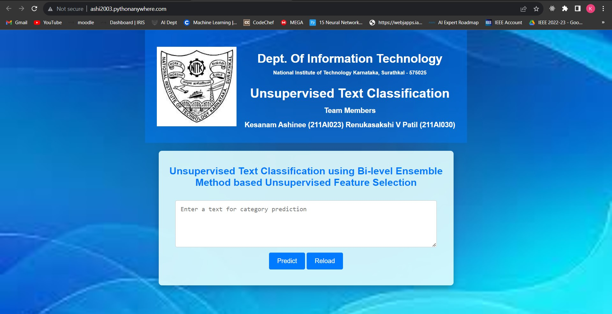

# Supervised-Text-Classification
As part of our Machine Learning Course Project 2023, implemented a Supervised Text Classification on BBC Dataset and achieved an overall accuracy of 97%. Deployed the model into a web application using flask.

Link to the webite - http://ashi2003.pythonanywhere.com/

### Teammates  
* Ashinee Kesanam
* Renukasakshi V Patil

## Dataset
Used the BBC Dataset for performing this task, which consisted of 
* 1490 rows
* 5 classes - Entertainment, Sports, Business, Technology, Politics

## Model
* Implemented Multinomial Naive Bayes Algorithm
* Attained an Accuracy of 97%

#### Model Results

## Frontend and Backend
Created Frontend using HTML, CSS and Backend using Flask

* Loads a pre-trained machine learning model for text classification, where users can input text, and the application uses a TF-IDF vectorizer to transform the input text and then predicts its category (Business, Technology, Politics, Sports, or Entertainment) based on the model's output, displaying the result on the web page.
* The application consists of two routes: the root route ('/') displays an input form for text, and the '/predict' route processes the user's input and returns the predicted category to be displayed on the web page.
* Hosted the website in Python Anywhere Platform

#### Website image

